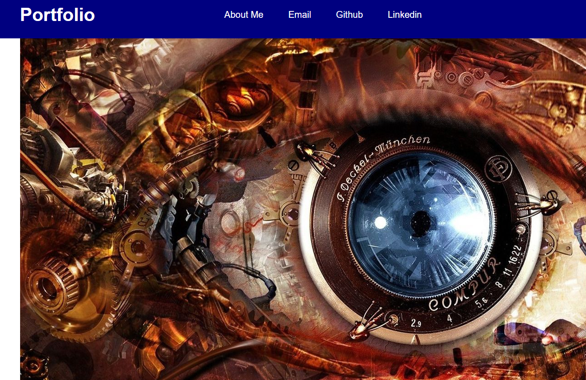

WEBDEV PORFOLIO PAGE:

# Introduction:
Building a Portfolio Website is essential for a webdeveloper as this website displays the individual's compelling work (a showcase) while providing basic information to potential clients.

# The Project's Aim:
The aim of this project is to draft a deployed portfolio website to a pontential employee so that the employer can review samples of their work and assess their candidacy for an open position.

# Technologies used:
HTML
CSS

# Learning progress:
What I have learned from this project:

1. This is first time I have ever created a project like this and sparked a motivation to keep trying to make a better and more improved webpages and applications in the future.

2. This is one of the most difficult tasks I had to complete as this  project requires organized and naturally flowing logic in HTML and CSS to showcase creativity.

3. The trouble of recalling proper syntax in HTML and CSS led to "writer's block". This was resolved by using pseudo code and rough diagrams to jog the memory and staying on course.

4. Interchanging between HTML and CSS screens led to improper syntax entered in wrong windows which caused delays in getting the design across. This led to retracing over past tasks and led to more "writer's block".

5. Since this is first project I have completed, I dont have much content to display. As a result, most of content are placeholders.

# Screenshot

